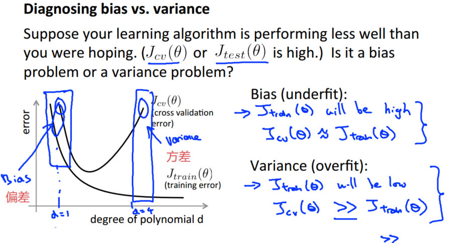
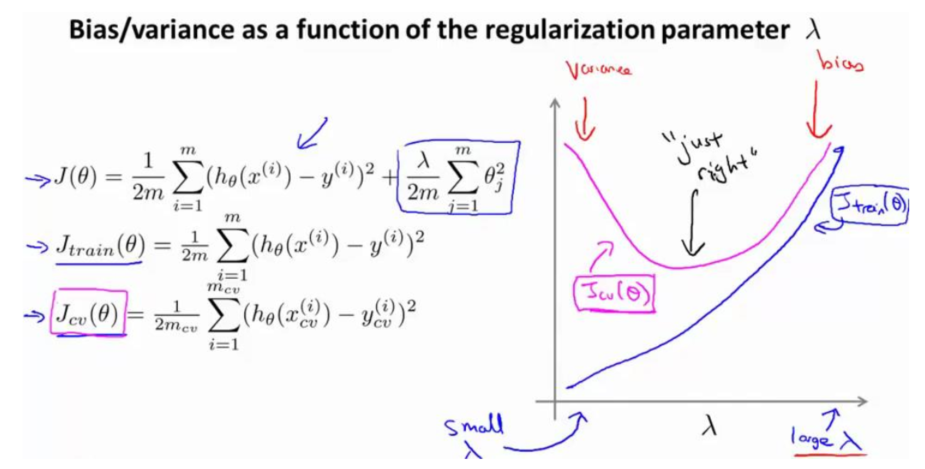
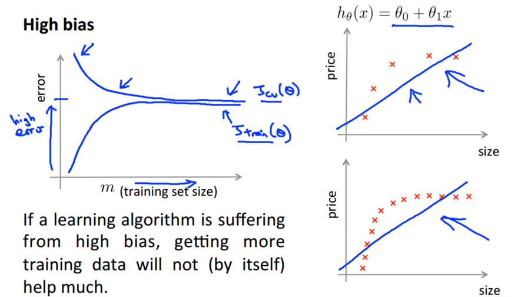
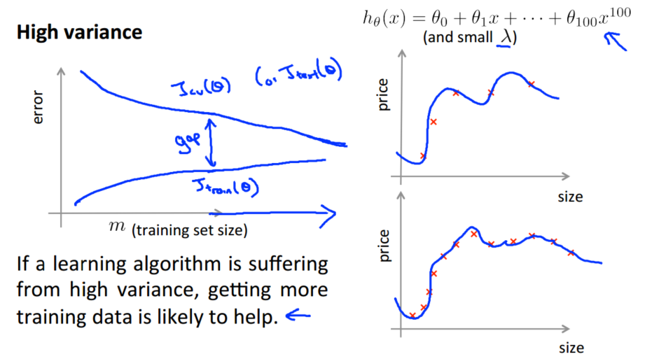
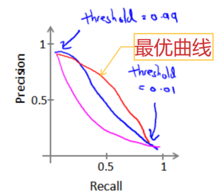
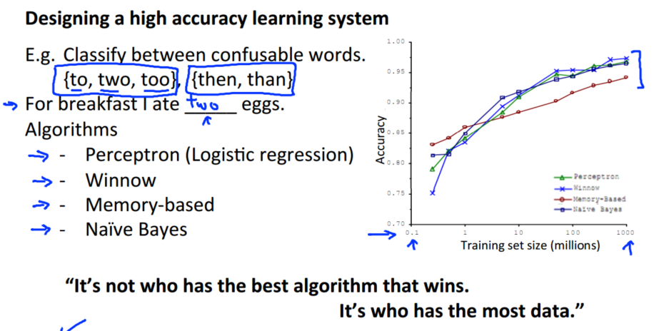
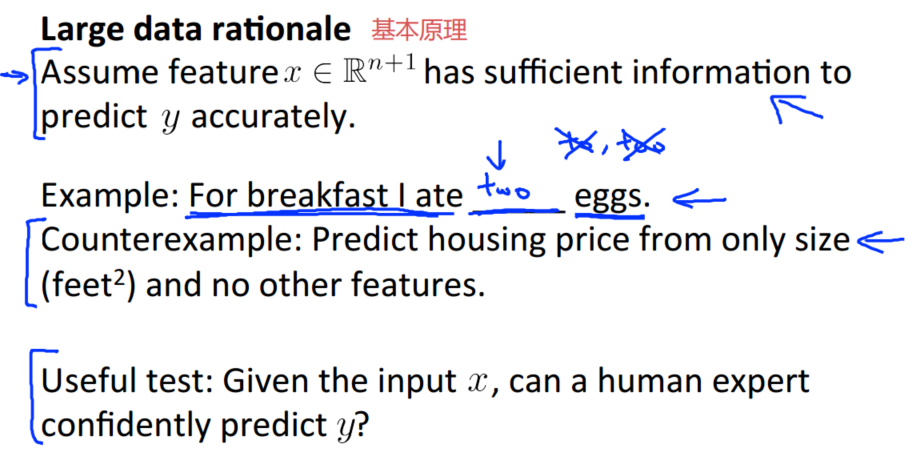
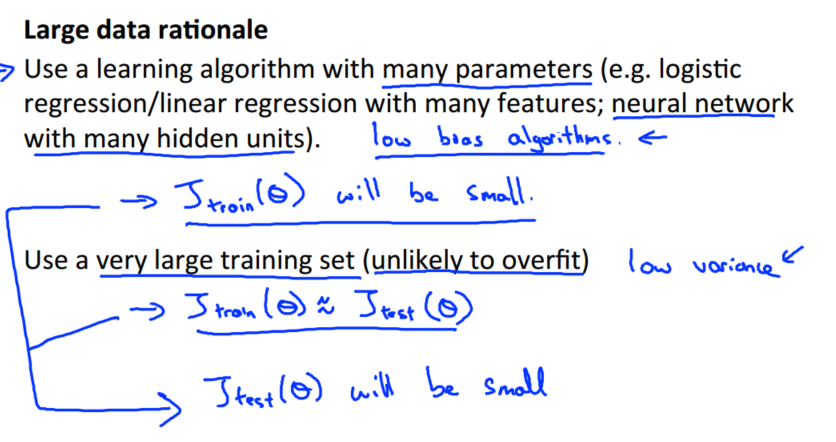
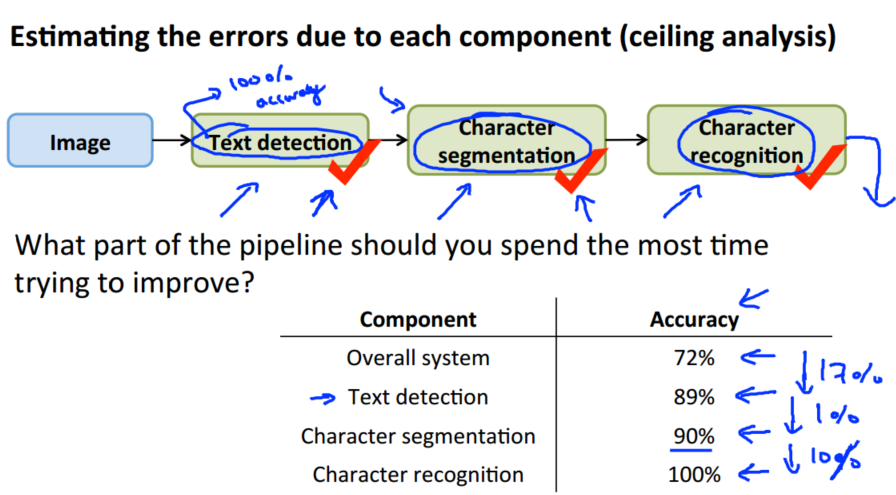

> 查看公式请安装插件[GitHub with MathJax](https://chrome.google.com/webstore/detail/github-with-mathjax/ioemnmodlmafdkllaclgeombjnmnbima)
<!-- TOC -->

- [调试学习算法](#调试学习算法)
- [评估一个假设](#评估一个假设)
- [模型选择](#模型选择)
- [偏差和方差](#偏差和方差)
    - [正则化和偏差/方差](#正则化和偏差方差)
    - [学习曲线与偏差/方差](#学习曲线与偏差方差)
- [调试总结](#调试总结)
- [机器学习系统的设计](#机器学习系统的设计)
    - [头脑风暴](#头脑风暴)
    - [快速实现](#快速实现)
    - [误差分析](#误差分析)
    - [总结](#总结)
- [类偏斜的误差度量](#类偏斜的误差度量)
- [机器学习的数据](#机器学习的数据)
- [分析流程中的单元](#分析流程中的单元)

<!-- /TOC -->
### 调试学习算法
当我们运用训练好的模型来预测未知数据的时候发现有较大的误差，则需要调试学习算法，选择有：
1. 获得更多的训练实例——通常是有效的，但代价较大，下面的方法也可能有效，可考虑先采用下面的几种方法。
2. 尝试减少特征的数量
3. 尝试获得更多的特征
4. 尝试增加多项式特征
5. 尝试减少归一化程度 λ
6. 尝试增加归一化程度 λ

在做出选择之前先诊断学习算法，虽然会耗费时间但避免盲目医治。

### 评估一个假设
为评估假设函数的好坏，一般情况想要通过画出假设函数来进行观察很难甚至不可能实现。

实际的方法：用70%的数据作为训练集，用剩下30%的数据作为测试集，通过训练集让模型学习得出其参数后，对测试集运用该模型，计算测试集误差来评估假设函数的好坏。

不同模型有不同的方式计算测试集误差：

### 模型选择
在对多种可能的模型中选择一个更能适应一般情况的模型，需要使用交叉验证集来帮助选择模型，不直接使用测试集的原因是避免对测试集过拟合。

实际的方法：使用60%的数据作为训练集，使用20%的数据作为交叉验证集，使用20%的数据作为测试集。模型选择的方法为：
1. 使用训练集训练出 10 个模型
2. 用 10 个模型分别对交叉验证集计算得出交叉验证误差（代价函数的值）
3. 选取代价函数值最小的模型
4. 用步骤 3 中选出的模型对测试集计算得出推广误差（代价函数的值）

### 偏差和方差
高偏差的问题是欠拟合，高方差的问题是过拟合。为判断偏差和方差的问题，通常会通过将训练集和交叉验证集的代价函数误差与多项式的次数绘制在同一张图表上来帮助分析。

结论：
- 训练集误差和交叉验证集误差近似时： 偏差/欠拟合
- 交叉验证集误差远大于训练集误差时： 方差/过拟合

#### 正则化和偏差/方差
测试不同的 λ 值，通常是 0-10 之间的呈现 2 倍关系的值（如：0,0.01,0.02,0.04,0.08,0.15,0.32,0.64,1.28,2.56,5.12,10 共 12 个）

选择 λ 的方法为：
1. 使用训练集训练出 12 个不同程度归一化的模型
2. 用 12 模型分别对交叉验证集计算的出交叉验证误差
3. 选择得出交叉验证误差最小的模型
4. 运用步骤 3 中选出模型对测试集计算得出推广误差， 我们也可以同时将训练集和交叉验证集模型的代价函数误差与 λ 的值绘制在一张图表上：

结论：
- 当 λ 较小时，训练集误差较小（过拟合）而交叉验证集误差较大
- 随着 λ 的增加，训练集误差不断增加（ 欠拟合），而交叉验证集误差则是先减小后增加

#### 学习曲线与偏差/方差
学习曲线是学习算法的一个很好的合理检验（sanity check），即将训练集误差和交叉验证集误差作为训练集实例数量（m）的函数绘制的图表（可以看成迭代周期）。

高偏差/欠拟合：误差较大，增加数据到训练集不一定能有帮助

高方差：当交叉验证集误差远大于训练集误差时，往训练集增加更多数据可以提高模型的效果

### 调试总结
解决高方差：
- 获得更多的训练实例
- 尝试减少特征的数量
- 尝试增加归一化程度λ

解决高偏差：
- 尝试获得更多的特征
- 尝试增加多项式特征
- 尝试减少归一化程度λ

针对神经网络：
- 使用较小的神经网络，类似于参数较少的情况，容易导致高偏差和欠拟合，但计算代价较小。
- 使用较大的神经网络，类似于参数较多的情况，容易导致高方差和过拟合，虽然计算代价比较大，但是可以通过归一化手段来调整而更加适应数据。
- 通常选择较大的神经网络并采用归一化处理会比采用较小的神经网络效果要好。

### 机器学习系统的设计

#### 头脑风暴
当我们使用机器学习时，总是可以“头脑风暴”一下，想出一堆方法来试试。实际上，当你需要通过头脑风暴来想出不同方法来尝试去提高精度的时候，你可能已经超越了很多人了。大部分人并不尝试着列出可能的方法，他们做的只是某天早上醒来，因为某些原因有了一个突发奇想。

#### 快速实现
最好的实践方法不是建立一个非常复杂的系统，拥有多么复杂的变量；而是构建一个简单的算法，这样你可以很快地实现它。即便方法是不够完美，但可以通过画出学习曲线来做出进一步的选择。我们必须用证据来领导我们的决策，怎样分配自己的时间来优化算法，而不是仅仅凭直觉，凭直觉得出的东西一般总是错误的。

#### 误差分析
当我们在构造垃圾邮件分类器时，我会看一看我的交叉验证数据集，然后亲自看一看哪些邮件被算法错误地分类。因此，通过这些被算法错误分类的垃圾邮件与非垃圾邮件， 你可以发现某些系统性的规律： 什么类型的邮件总是被错误分类。 经常地这样做之后， 这个过程能启发你构造新的特征变量， 或者告诉你： 现在这个系统的短处， 然后启发你如何去提高它。

#### 总结
构建一个学习算法的推荐方法为：
1. 从一个简单的能快速实现的算法开始，实现该算法并用交叉验证集数据测试这个算法
2. 绘制学习曲线，决定是增加更多数据，或者添加更多特征，还是其他选择
3. 进行误差分析：人工检查交叉验证集中我们算法中产生预测误差的实例，看看这些实例是否有某种系统化的趋势
4. 数值评估：直观地告诉你，想法是提高了算法表现，还是让它变得更坏，这会大大提高你实践算法时的速度。

### 类偏斜的误差度量
类偏斜是指训练集中有非常多的同一种类的实例，只有很少或没有其他类的实例。

例如我们希望用算法来预测癌症是否是恶性的，在我们的训练集中，只有0.5%的实例是恶性肿瘤。假设我们编写一个非学习而来的算法，在所有情况下都预测肿瘤是良性的，那么误差只有0.5%然而我们通过训练而得到的神经网络算法却有1%的误差。这时，误差的大小是不能视为评判算法效果的依据的。

为选择一个合适的误差度量值，引入查准率（Precision）和查全率（Recall，又被称为召回率）。将算法预测的结果分成四种情况：
1. 正确肯定（True Positive,TP）：预测为真，实际为真
2. 正确否定（True Negative,TN）：预测为假，实际为假
3. 错误肯定（False Positive,FP）：预测为真，实际为假
4. 错误否定（False Negative,FN）：预测为假，实际为真

则：
- 查准率=TP/（ TP+FP）例，在所有我们预测有恶性肿瘤的病人中，实际上有恶性肿瘤的病人的百分比，越高越好。
- 查全率=TP/（ TP+FN）例，在所有实际上有恶性肿瘤的病人中，成功预测有恶性肿瘤的病人的百分比，越高越好。

前面预测病人肿瘤全为良性的算法，其查全率是0，但实际希望能够保证查准率和召回率的相对平衡。

假使我们的算法输出的结果在 0-1 之间，我们使用阀值 0.5 来预测真和假，并对查准率和查全率探索：
- 为提高查准率，我们可以使用比 0.5 更大的阀值，如 0.7，0.9。这样做我们会减少错误预测病人为恶性肿瘤的情况，同时却会增加未能成功预测肿瘤为恶性的情况。
- 为提高查全率，尽可能地让所有有可能是恶性肿瘤的病人都得到进一步地检查、诊断，我们可以使用比 0.5 更小的阀值，如 0.3。

在不同阀值情况下，将查全率与查准率的关系绘制成图表：

选择最优阀值的方法是计算 F1 值(F1 Score)作为阈值。

### 机器学习的数据
虽然不能盲目地采集数据，但数据量大小很重要，许多不同的学习算法有时倾向于表现出非常相似的表现，这还取决于一些细节，但是真正能提高性能的，是你能够给一个算法大量的训练数据。

大数据起作用的原因：

条件1，特征值有足够的信息来预测 y 值

条件2，确保有一个具有很多参数的学习算法来解决偏差问题，以及非常大的训练集来保证训练误差和测试误差相近，即解决过拟合。

如果模型是低方差的，那么获得更多的数据用于训练模型能够有更好的效果，以下为获得更多数据的几种方法：
1. 人工数据合成
2. 手动收集、标记数据
3. 众包

### 分析流程中的单元
在机器学习的应用中，通常需要通过几个步骤才能进行最终的预测，通过单元分析能够知道哪一部分最值得我们花时间和精力去改善呢。

以文字识别应用为例，流程图为：

流程图中每一部分的输出都是下一部分的输入，单元分析的做法是，我们选取一部分，手工提供100%正确的输出结果，然后看应用的整体效果提升了多少。

如上图可见，文字检测是最值得花时间和精力研究的。