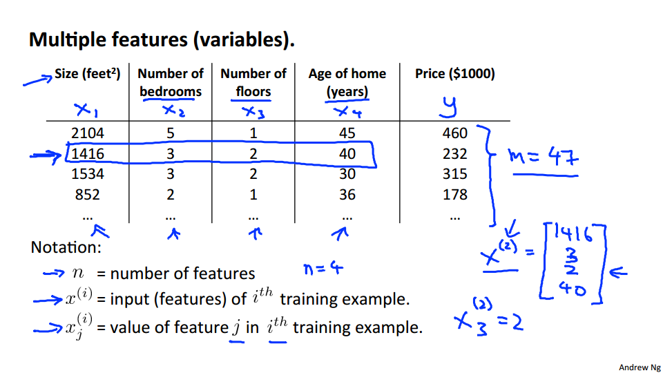

> 查看公式请安装插件[GitHub with MathJax](https://chrome.google.com/webstore/detail/github-with-mathjax/ioemnmodlmafdkllaclgeombjnmnbima)

### 多维特征
了解单变量/特征的回归模型后，不妨对房价模型增加更多的特征，例如房间数楼层等，构成一个含有多个变量的模型，模型中的特征为$(x_1,x_2,...,x_n)$。

更新注释方式：
- n 代表特征的数量
- $x^{(i)}$代表第 i 个训练实例，是特征矩阵中的第 i 行，是一个向量(vector)
- $x^{(i)}_j$代表特征矩阵中第 i 行的第 j 个特征，也就是第 i 个训练实例的第 j 个特征。
- 支持多变量的假设 h 表示为：$h_θ(x)=θ_0+θ_1x_1+θ_2x_2+...θ_nx_n$

### 多变量梯度下降
与单变量线性回归类似，构建多变量回归模型：

多变量线性回归的批量梯度下降算法为：

### 技巧：特征缩放
将特征统一在-1~1的范围内，否则代价函数的等高线图显得奇形怪状，梯度下降算法需要非常多次的迭代才能收敛。常用的是均值归一化：

### 技巧：学习率
为确保梯度下降算法工作正常，可以绘制迭代次数和代价函数的图表来观测算法，常常将代价函数的变化值与某个阀值（例如 0.001）进行比较来判断收敛的时刻。

梯度下降算法的每次迭代受到学习率的影响，如果学习率 α 过小，则达到收敛所需的迭代次数会非常高；如果学习率 α 过大，每次迭代可能不会减小代价函数，可能会越过局部最小值导致无法收敛。通常考虑如下学习率：α=0.01， 0.03， 0.1， 0.3， 1， 3， 10

### 特征和多项式回归
线性回归并不适用于所有数据，有时需要曲线或者说多个复杂特征来拟合数据，即多项式回归，此时注意特征归一化。

选择好特征会得到更好的模型，比如房价预测问题，利用房子宽度和长度两个参数不如利用房子面子一个参数，为选择更好的特征需要经验知识和观察数据，以下是平方和根方的选择比较。

### 正规方程

